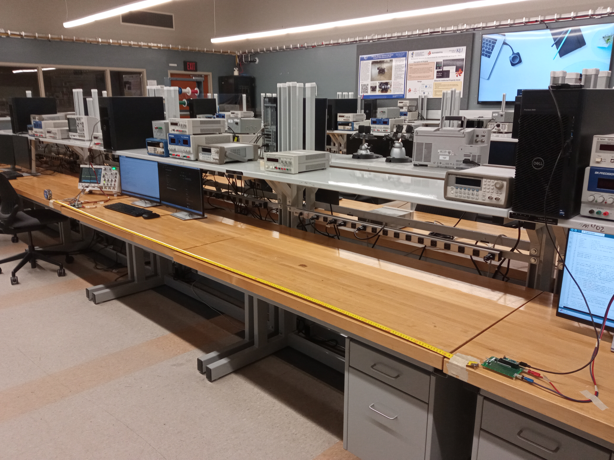
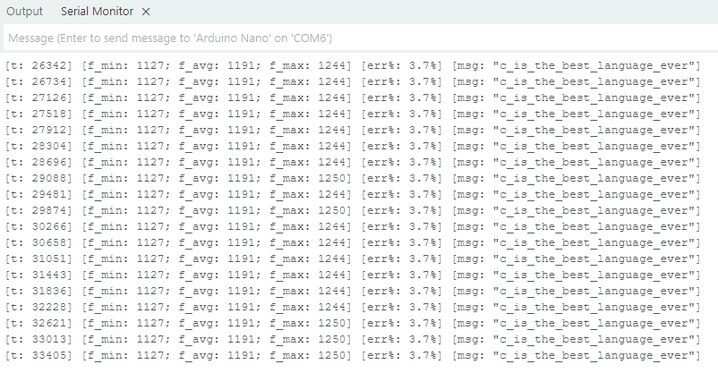
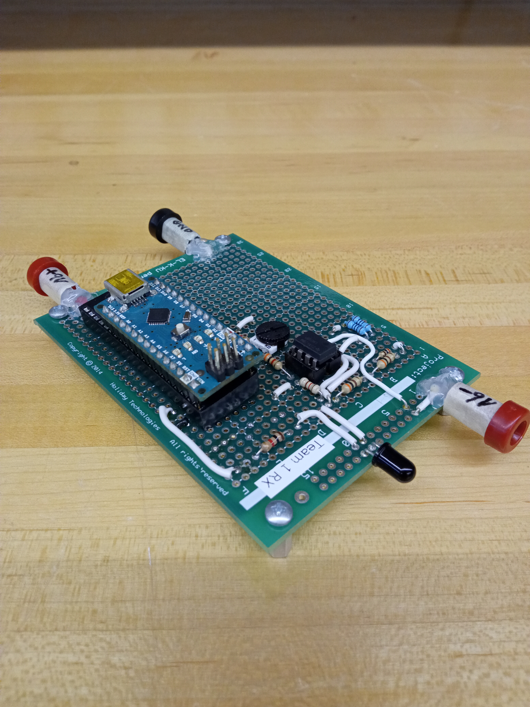
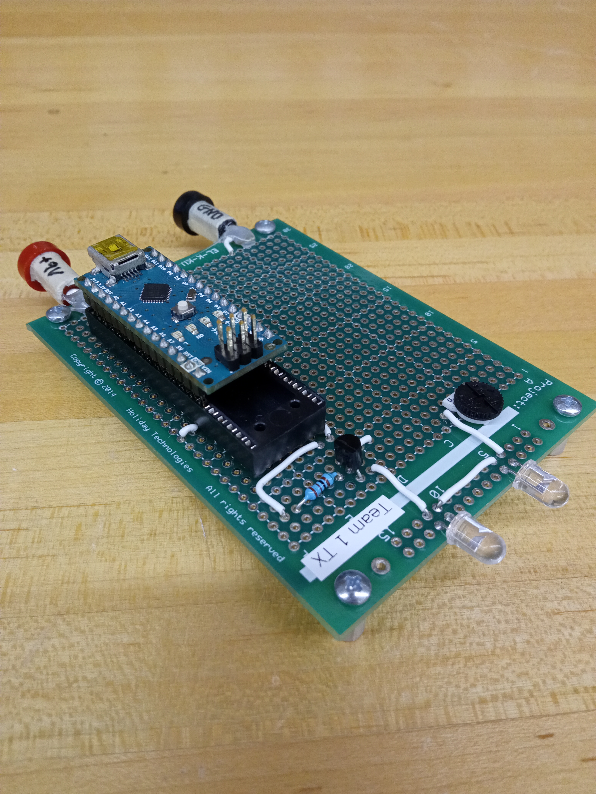
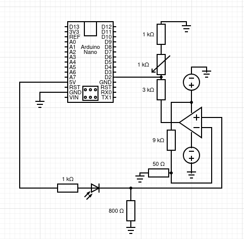
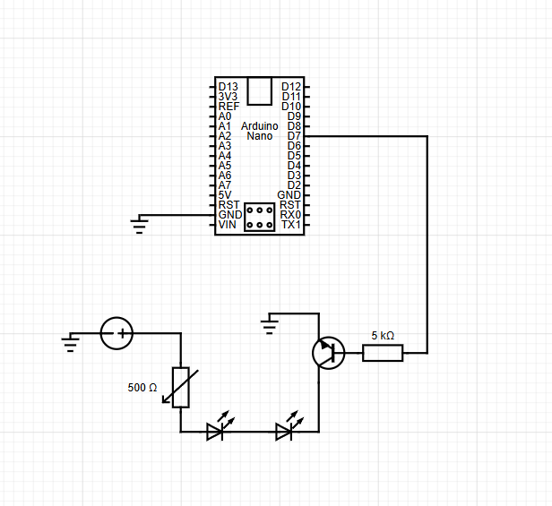
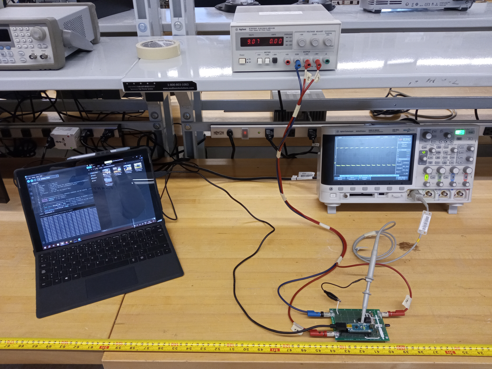
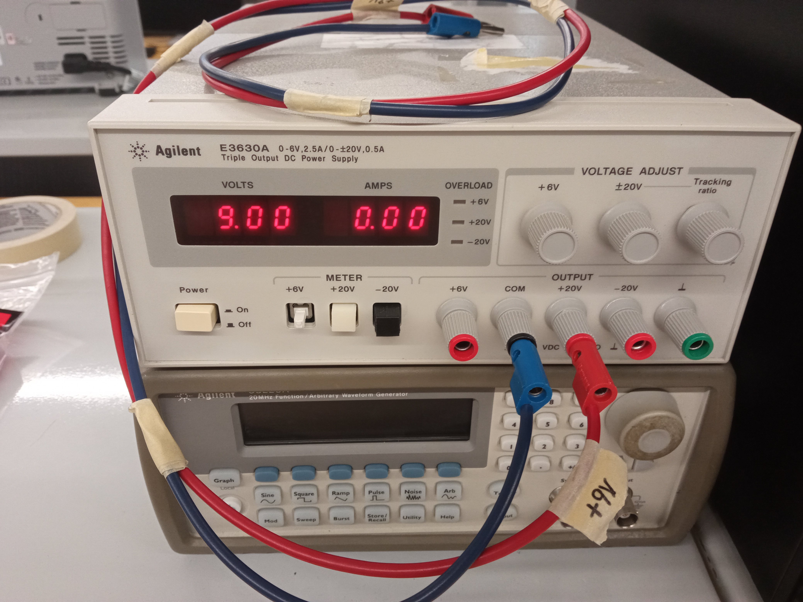
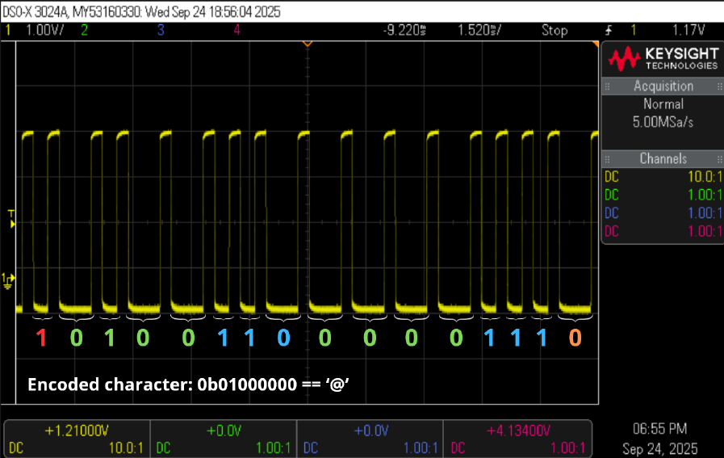

# Short-range IR Telecommunications System

- **Institution:** University of Kansas
- **Course:** EECS 541 (Computer Systems Design Lab I)
- **Honors & Awards:** Winner of the "McNaughton Award" (**largest transmission distance**)

<table>
  <tr>
    <td align="center">
       
      <em>Figure 1: Maximum distance achieved by the system.</em>
    </td>
    <td align="center">
       
      <em>Figure 2: Serial monitor output for the receiver board (RX).</em>
    </td>
</table>

This short-range telecommunications system leverages Pulse Frequency Modulation (PFM) (an encoding scheme where data is encoded by the time difference between subsequent pulses) to transmit ASCII messages over the infrared spectrum (center frequency of 1.2KHz with a deviation of 30Hz). Characters are transmitted in individual packets which contain their binary encoding, start and stop bits, and 6 parity bits (3 per nibble). Error correction is applied to the starting and ending nibbles of the character using their associated parity bits. A maximum transmission distance of 3 meters was achieved by employing a single IR LED on the transmitter and two IR sensors on the receiver, the largest achieved among all competing teams.

<table>
  <tr>
    <td align="center">
       
      <em>Figure 3: Receiver board (RX) for the telecom. system.</em>
    </td>
    <td align="center">
       
      <em>Figure 4: Transmitter board (TX) for the telecom. system.</em>
    </td>
  </tr>
  <tr>
    <td align="center">
       
      <em>Figure 5: Receiver's electric circuit diagram.</em>
    </td>
    <td align="center">
       
      <em>Figure 6: Transmitter's electric circuit diagram.</em>
    </td>
  </tr>
  <tr>
    <td align="center">
       
      <em>Figure 7: Oscilloscope and power setup for the receiver board (RX).</em>
    </td>
    <td align="center">
       
      <em>Figure 8: Power supply setup for the transmitter board (TX). </em>
    </td>
  </tr>
</table>

# Team roster

- **Leo Cabezas Amigo**: Embedded Systems Lead.
- **Daniel Gonzales**: Hardware Lead.
- **Kieran Egan**: Software Engineer.
- **Fahad Almarri**: Software Engineer.

# Deployment instructions

# How it works

<figure align="center">
   
  <figcaption><em>Figure 9: Example of Pulse Frequency Modulation (PFM) encoding for '@'.</em></figcaption>
</figure>
  

Download the final report for this project [here](docs/files/EECS_541_Project1_Team1.pdf).

